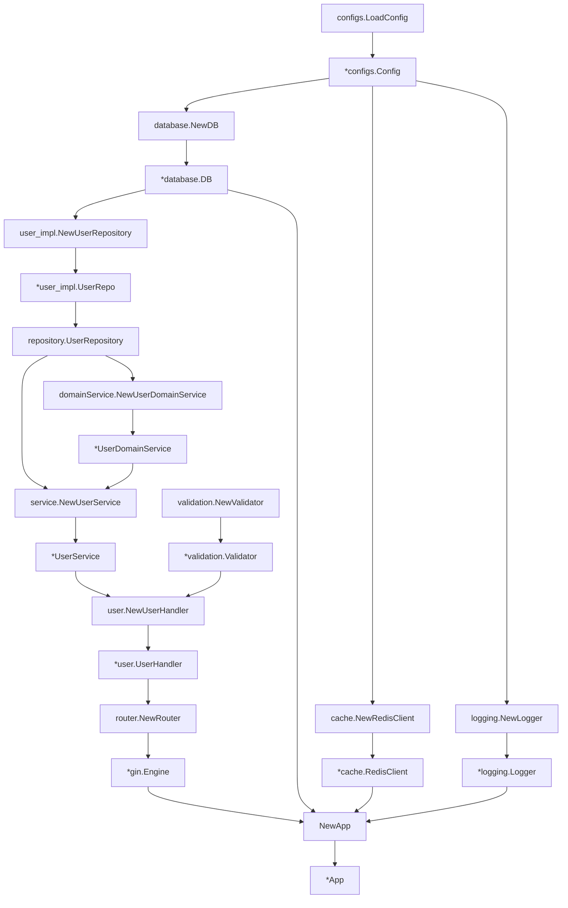

# Wire 依赖注入的工作原理

## 核心概念

Wire 是 Google 开源的编译时依赖注入工具，它通过**代码生成**而不是运行时反射来实现依赖注入。

## 项目中的 Wire 配置

Provider 定义 (wire/provider.go)

```go
// 基础设施层依赖
var InfraSet = wire.NewSet(
    configs.LoadConfig,           // 提供 *configs.Config
    database.NewDB,               // 需要 *configs.Config，提供 *database.DB
    cache.NewRedisClient,         // 需要 *configs.Config，提供 *cache.RedisClient
    logging.NewLogger,            // 需要 *configs.Config，提供 *logging.Logger
)

// 仓储层依赖
var RepositorySet = wire.NewSet(
    user_impl.NewUserRepository,  // 需要 *database.DB，提供 *user_impl.UserRepo
    wire.Bind(new(repository.UserRepository), new(*user_impl.UserRepo)), // 接口绑定
)

// 领域服务依赖
var DomainServiceSet = wire.NewSet(
    domainService.NewUserDomainService, // 需要 repository.UserRepository，提供 *UserDomainService
)

// 应用服务依赖
var ServiceSet = wire.NewSet(
    service.NewUserService, // 需要 repository.UserRepository 和 *UserDomainService
)
```

Wire 初始化文件 (wire/wire.go)

```go
//go:build wireinject
// +build wireinject

// InitializeApp 初始化应用
func InitializeApp() (*App, func(), error) {
    panic(wire.Build(
        InfraSet,         // 基础设施层
        RepositorySet,    // 仓储层
        DomainServiceSet, // 领域服务层
        ServiceSet,       // 应用服务层
        ValidationSet,    // 验证层
        HandlerSet,       // 控制器层
        RouterSet,        // 路由层
        NewApp,           // 应用构造函数
    ))
}
```

## 依赖关系图



## Wire 生成的代码 (wire/wire_gen.go)

当运行 wire 命令时，Wire 会分析依赖关系并生成类似这样的代码：

```go
func InitializeApp() (*App, func(), error) {
    // 1. 加载配置
    config := configs.LoadConfig()
    
    // 2. 创建基础设施组件
    db := database.NewDB(config)
    redisClient := cache.NewRedisClient(config)
    logger := logging.NewLogger(config)
    
    // 3. 创建仓储实现
    userRepo := user_impl.NewUserRepository(db)
    
    // 4. 创建领域服务
    userDomainService := domainService.NewUserDomainService(userRepo)
    
    // 5. 创建应用服务
    userService := service.NewUserService(userRepo, userDomainService)
    
    // 6. 创建验证器
    validator := validation.NewValidator()
    
    // 7. 创建控制器
    userHandler := user.NewUserHandler(userService, validator)
    
    // 8. 创建路由
    engine := router.NewRouter(userHandler)
    
    // 9. 创建应用
    app := NewApp(engine, db, redisClient, logger)
    
    return app, func() {
        // 清理函数（如果需要）
    }, nil
}
```

## 关键的依赖注入点

UserService 的注入

UserService 是如何被注入的：

```go
type UserService struct {
    userRepo          repository.UserRepository  // 接口类型
    userDomainService *domainService.UserDomainService
}

func NewUserService(userRepo repository.UserRepository, userDomainService *domainService.UserDomainService) *UserService {
    return &UserService{
        userRepo:          userRepo,
        userDomainService: userDomainService,
    }
}
```

Wire 会：

1. 看到 NewUserService 需要两个参数
2. 查找能提供 repository.UserRepository 的 provider
3. 通过 wire.Bind 找到 *user_impl.UserRepo 实现了这个接口
4. 查找能提供 *domainService.UserDomainService 的 provider
5. 按正确顺序调用所有构造函数

## 接口绑定的关键

```go
// 在 provider.go 中
wire.Bind(new(repository.UserRepository), new(*user_impl.UserRepo))
```

这行代码告诉 Wire：当需要 repository.UserRepository 接口时，使用 *user_impl.UserRepo 实现。

## 实际执行流程

编译时：运行 wire 命令生成 wire_gen.go
运行时：调用 wire.InitializeApp()
依赖解析：Wire 按依赖顺序创建所有对象
返回完整应用：所有依赖都正确注入

## 为什么这样设计？

优势：

- 编译时检查：依赖错误在编译时发现
- 零运行时开销：没有反射性能损失
- 类型安全：完全的类型检查
- 依赖图可视化：可以清楚看到所有依赖关系

对比运行时依赖注入：

```go
// 运行时依赖注入（如 Spring）
container.Register(UserService, func() UserService {
    return NewUserService(container.Get(UserRepository), container.Get(UserDomainService))
})

// Wire 编译时依赖注入
// 生成具体的构造函数调用，没有运行时开销
```

## 如何添加新的依赖？

1.创建 Provider：

```go
// 在 wire/provider.go 中添加
var ProductSet = wire.NewSet(
    product_impl.NewProductRepository,
    wire.Bind(new(product_repository.ProductRepository), new(*product_impl.ProductRepo)),
    product_service.NewProductService,
    product_handler.NewProductHandler,
)
```

2.添加到构建集合：

```go
// 在 wire/wire.go 中
func InitializeApp() (*App, func(), error) {
    panic(wire.Build(
        // ... 其他集合
        ProductSet,  // 新增
        // ...
    ))
}
```

3.重新生成代码：

```bash
cd wire && wire && cd ..
```

这就是 Wire 依赖注入的完整工作原理！它通过静态分析和代码生成，在编译时就确定了所有的依赖关系，运行时只是简单的函数调用。
